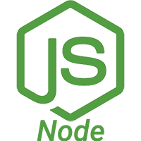
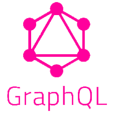
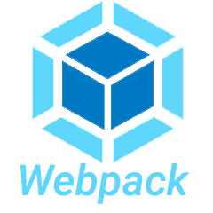

## Hi there i'm David 👋
<div style="display:flex;">










</div>

### - A little about me 🤔
```javascript
const davshn = {
    pronouns: "He" | "Him",
    code: ["Javascript", "Typescript"],
    askMeAbout: ["web dev", "tech", "role playing", "videogames"],
    technologies: {
        frontEnd: {
            js: ["React,Redux"],
        },
        backEnd: {
            js: ["Node,Express","GraphQl"],
        },
        databases: {
            sql: ["Sequalize", "PosgreSql"],
        },
        mobile: {
            js: ["React Native"],
        },
        devOps: ["AWS"],
        tools: ["Terminal", "Visual Studio Code","Github"]
    },
    techCommunities: {
                        student: ["Henry", "No country"],
                        colaborator: "Foundry Vtt Developers"
    },
    currentProject: "I am improving my developing skills"
};
```
### -You can find me :satellite:
- [Portfolio](https://www.davshn.tech/)
- [Linkedin](https://www.linkedin.com/in/davshn/)
- [Facebook](https://www.facebook.com/david.figueroa.184)
- [Youtube](https://www.youtube.com/user/davshn/)
- [Twitter](https://twitter.com/Davshmr)

[](https://github.com/davshn/github-profile-trophy)

### -Stats :battery:

<p>&nbsp;</p>

<p></p>

    Activity This Week
<!--START_SECTION:waka-->

```text
From: 09 March 2022 - To: 16 March 2022

TypeScript   7 hrs 2 mins    ⣿⣿⣿⣿⣿⣿⣿⣿⣿⣿⣿⣿⣿⣿⣿⣿⣿⣿⣿⣶⣀⣀⣀⣀⣀   78.70 %
JSON         1 hr 16 mins    ⣿⣿⣿⣦⣀⣀⣀⣀⣀⣀⣀⣀⣀⣀⣀⣀⣀⣀⣀⣀⣀⣀⣀⣀⣀   14.26 %
JavaScript   20 mins         ⣿⣀⣀⣀⣀⣀⣀⣀⣀⣀⣀⣀⣀⣀⣀⣀⣀⣀⣀⣀⣀⣀⣀⣀⣀   03.89 %
HTML         9 mins          ⣦⣀⣀⣀⣀⣀⣀⣀⣀⣀⣀⣀⣀⣀⣀⣀⣀⣀⣀⣀⣀⣀⣀⣀⣀   01.77 %
Bash         7 mins          ⣤⣀⣀⣀⣀⣀⣀⣀⣀⣀⣀⣀⣀⣀⣀⣀⣀⣀⣀⣀⣀⣀⣀⣀⣀   01.33 %
Markdown     0 secs          ⣀⣀⣀⣀⣀⣀⣀⣀⣀⣀⣀⣀⣀⣀⣀⣀⣀⣀⣀⣀⣀⣀⣀⣀⣀   00.05 %
```

<!--END_SECTION:waka-->
